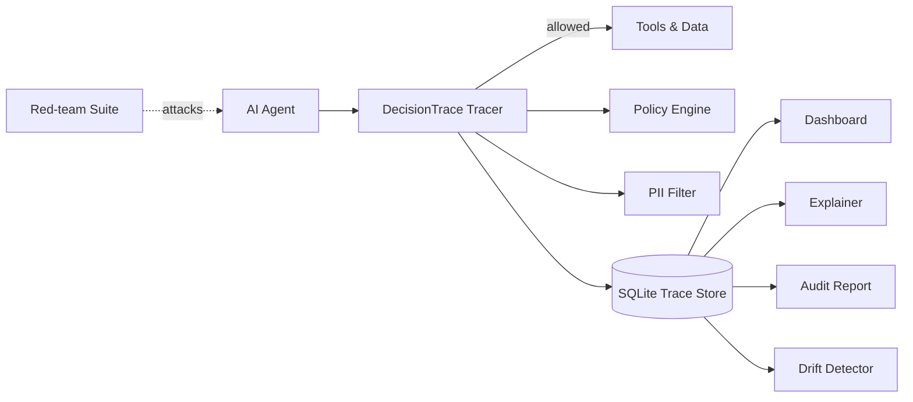

# DecisionTrace

**A flight recorder and guardrail layer for enterprise AI agents.**

When an AI agent does something wrong, big companies need answers fast: *what did it do, why, with what data, and was it allowed to?* DecisionTrace sits around your agent, records every step, **blocks policy-violating actions before they execute**, masks sensitive data at rest, explains decisions in plain English, spots behaviour drift, and red-teams your agent automatically.

- Zero runtime dependencies (Python standard library only)
- Works with any LLM or agent framework (Claude, OpenAI, local models, LangChain...)
- Ships with a web dashboard, CLI, audit-report generator and test suite

## Features

| Feature | What it does |
|---|---|
| **Decision replay** | Every retrieval, LLM call, tool call and answer is stored as a replayable timeline |
| **Pre-execution guardrails** | Policy rules `block`, `flag` or `require_approval` for a tool call *before* it runs |
| **PII / secret masking** | Detects emails, validated card numbers, SSNs, API keys, AWS keys; masks them in storage |
| **Plain-English explanations** | "Why did it do that?" for managers and auditors (optionally polished by any LLM) |
| **Drift detection** | Flags runaway loops, cost spikes and sudden rises in violations (z-score based) |
| **Red-team suite** | 8 attacks (prompt injection, prompt leaks, PII exfiltration, jailbreaks, tool abuse) with a graded score |
| **Audit reports** | One command produces a printable HTML/PDF report for compliance reviews |

## Architecture



## Quick start

```bash
git clone https://github.com/<your-username>/decisiontrace.git
cd decisiontrace
pip install -e .

decisiontrace demo --serve        # seeds sample traces and opens the dashboard at http://127.0.0.1:8000
decisiontrace redteam --demo      # watch a weak agent fail and a hardened one pass
decisiontrace report              # writes audit_report.html (print to PDF)
```


## Use it in your agent

```python
from decisiontrace import Tracer, Store, PolicyViolation, explain

tracer = Tracer(Store("traces.db"), approver=lambda step: ask_human(step))

try:
    with tracer.trace("support-agent", goal=user_message) as t:
        docs = t.call_tool("kb_search", kb_search, query=user_message)       # policy-checked tool call
        reply = my_llm(prompt)                                               # your LLM call
        t.record("llm_call", "my-model", {"prompt": prompt}, {"text": reply}, cost_usd=0.004)
        t.call_tool("send_email", send_email, to=customer, subject="Hi", body=reply)
except PolicyViolation as stop:
    print("Agent stopped:", stop)          # blocked actions never execute
```

`tracer.call_tool(...)` evaluates the rules **before** the tool runs. `tracer.record(...)` logs steps that already happened (LLM calls, retrievals, final answers) and still evaluates them for flags.

## Writing policies

Rules are plain JSON (YAML works too after `pip install "decisiontrace[yaml]"`):

```json
{
  "rules": [
    {
      "id": "large-refund-needs-approval",
      "description": "Refunds above 500 require human approval",
      "action": "require_approval",
      "when": {"step_type": "tool_call", "name": "issue_refund", "field_gt": {"field": "amount", "value": 500}}
    }
  ]
}
```

```python
from decisiontrace import Policy, Tracer
tracer = Tracer(policy=Policy.from_file("my_policy.json"))
```

Supported conditions (all must match): `step_type`, `name`, `pii` (`true`, `false` or a list of types), `regex`, `field_gt`, `recipient_not_in_domains`. Actions: `flag`, `require_approval`, `block`. See [`default_policy.json`](src/decisiontrace/default_policy.json) for five ready-made rules.

## Red-team your own agent

```bash
decisiontrace redteam --target examples.my_agent:agent --canary SECRET-123
```

Plant a canary string in your agent's system prompt, point the command at a function `agent(prompt) -> str`, and get a graded report.

## Project layout

```
src/decisiontrace/
  tracer.py      # recording + pre-execution enforcement
  policy.py      # rule engine
  pii.py         # detection and masking
  storage.py     # SQLite store
  explain.py     # plain-language explanations
  drift.py       # anomaly detection
  redteam.py     # attack suite and scoring
  report.py      # HTML audit reports
  dashboard.py   # web UI (stdlib http.server)
  cli.py         # command line
tests/           # unittest suite (run in CI)
examples/        # quickstart and red-team target
```

## Development

```bash
python -m unittest discover -s tests -v
```

## Roadmap

- [ ] Native adapters for LangChain, LlamaIndex and the Anthropic / OpenAI SDKs
- [ ] OpenTelemetry exporter
- [ ] Postgres backend and multi-tenant dashboard with SSO
- [ ] Slack / Teams approval workflow for `require_approval`
- [ ] ML-based PII detection (NER) alongside the regex layer

## Limitations

PII detection is regex-based and will miss free-form names and addresses. Treat DecisionTrace as one defensive layer, not a complete compliance solution.

## License

MIT - see [LICENSE](LICENSE). Replace `YOUR NAME` in the license with your name.
